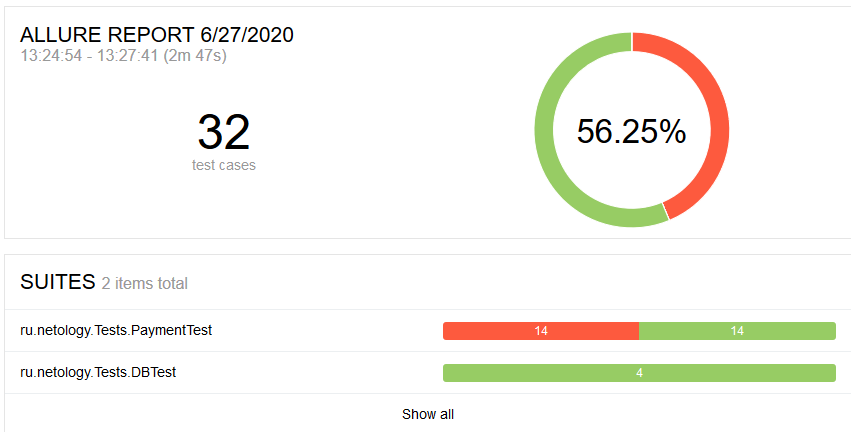

## Отчет по итогам тестирования

### Краткое описание
* В ходе автоматизации тестирования были реализованы позитивные и негативные сценарии заполнения тестовой страницы
* Реализована поддержка двух БД - MySQL и PostgreSQL

* Автоматизация тестирования сервиса "Путешествие дня" выполнялась с использованием следующих инструментов:
    * Intellij IDEA 2019.3.1 (Community edition)
    * Java 11 
    * Docker desktop community 2.3.0.3
    * junit-jupiter: 5.6.1
    * selenide: 5.6.0
    * rest-assured: 4.1.2
    * allure 2.13.1
    * faker 1.0.1

Для работы с БД и симулятором банковских сервисов использовался docker

Были протестированы сценарии:
* Успешная покупка по карте и в кредит с использованием карты
* Отказ банка с покупкой по карте и в кредит с использованием карты
* Негативные проверки полей: невалидные значения, незаполненные поля
* Проверка записи данных в БД при использовании MySQL и PostgreSQL

### Результаты

* Всего: 32 тест-кейсов
* Успешных: 18 (56%)
* Неуспешных: 14 (44%)

### Общие рекомендации

#### Найденные баги

* [Заведено 15 Issues](https://github.com/AlexeySuchkov/QA-Diploma/issues)

#### Рекомендации по улучшению интерфейса

* Создать спецификацию для данного приложения
* Исправить ошибку в слове "Марракэш". Правильно - Марракеш.
* Реализовать валидацию номера карты, кроме размера.
* Реализовать валидацию имени владельца карты (запретить ввод всего кроме латиницы).
* При попытке отправить пустые поля, реализовать появление предупреждающей надписи "Поле обязательно для заполнения" вместо "Неверный формат". 
